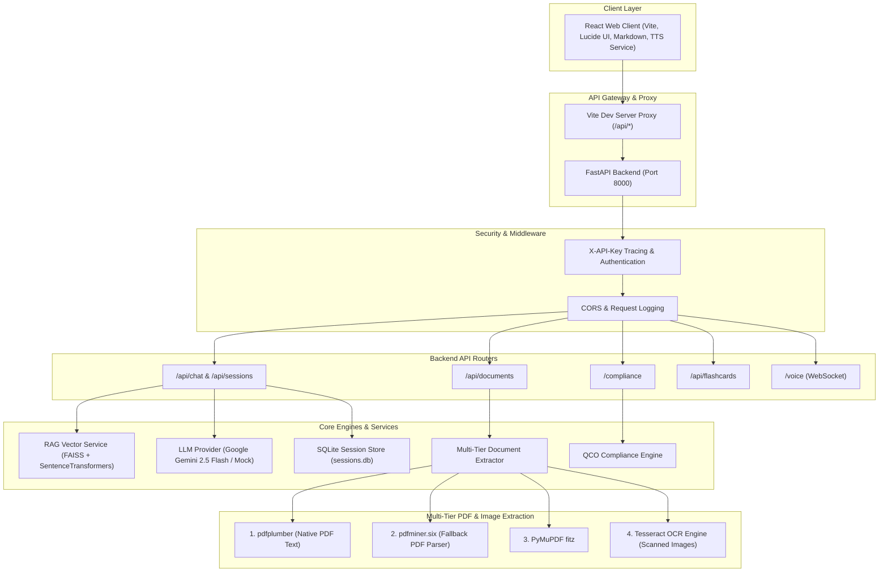

# 🇮🇳 BIS Sahayta — Bureau of Indian Standards Intelligence Assistant

An AI-powered compliance, document intelligence, and standards assistant for the **Bureau of Indian Standards (BIS)**. Features multilingual RAG Q&A, multi-tier document extraction (PDF/OCR), dynamic compliance checking, study flashcard generation, real-time voice WebSockets, and a modern React client with browser-native TTS.

---

## 🏛 Full System Architecture



---

## 🚀 Quick Start Guide

### Prerequisites
- **Python**: `3.10` or higher
- **Node.js**: `v18` or higher
- **npm**: `v9` or higher

---

### 1. Backend Setup (FastAPI)

```powershell
# 1. Navigate to backend directory
cd backend

# 2. Create and activate a Python virtual environment
python -m venv venv
.\venv\Scripts\Activate.ps1   # On Linux/macOS: source venv/bin/activate

# 3. Install Python dependencies
pip install -r requirements.txt

# 4. Copy environment configuration file
Copy-Item .env.example .env

# 5. Add your Gemini API key in backend/.env:
# GEMINI_API_KEY="your_api_key_here"

# 6. Start backend development server
python -m uvicorn app.main:app --host 127.0.0.1 --port 8000 --reload
```

---

### 2. Frontend Setup (React + Vite)

```powershell
# Open a new terminal and navigate to frontend
cd frontend

# 1. Install dependencies
npm ci

# 2. Copy frontend environment config
Copy-Item .env.example .env

# 3. Start Vite frontend dev server
npm run dev -- --host 127.0.0.1
```

Once running, open your browser to **`http://127.0.0.1:5173/`**.

---

## ⚙️ Environment Configuration

### Backend (`backend/.env`)

| Variable | Default Value | Description |
| :--- | :--- | :--- |
| `API_KEY` | `demo-key-123` | Secret header key expected by backend middleware (`X-API-Key`) |
| `LLM_PROVIDER` | `gemini` | AI Provider selection (`gemini` or `mock`) |
| `GEMINI_API_KEY` | `""` | Google AI Studio API key |
| `GEMINI_MODEL` | `gemini-2.5-flash` | Gemini model name |
| `OCR_PROVIDER` | `mock` | OCR Engine (`mock` or `tesseract`) |
| `UPLOAD_DIR` | `storage/uploads` | Directory path for uploaded user files |
| `VECTORSTORE_DIR` | `storage/vectorstore` | FAISS index and chunk storage path |

### Frontend (`frontend/.env`)

| Variable | Default Value | Description |
| :--- | :--- | :--- |
| `VITE_API_KEY` | `demo-key-123` | Matches backend `API_KEY` for header requests |

---

## 🧪 Testing & Verification Suite

### Backend Unit & Integration Tests (117 Tests)

```powershell
cd backend
python -m pytest -q
```

### Python Syntax Verification

```powershell
cd backend
python -m compileall -q app
```

### Frontend Production Build

```powershell
cd frontend
npm run build
```

### Automated End-to-End Live Acceptance Test

With the backend running on `http://127.0.0.1:8000`:
```powershell
cd backend
python scratch/e2e_live_test.py
```

---

## 🔊 Multilingual Speech Synthesis (TTS) Engine

The frontend includes an advanced, browser-native TTS service ([frontend/src/services/ttsService.js](file:///c:/Users/Admin%20pc/Desktop/bis-sahayta-main123/frontend/src/services/ttsService.js)):

- **Automatic Script Language Detection**: Detects Devanagari (Hindi/Marathi), Telugu, Urdu, Bengali, Tamil, Kannada, Malayalam, Gujarati, and English using Unicode character ranges.
- **Markdown & Citation Pre-cleaning**: Strips raw Markdown syntax (`#`, `**`, ` ``` `, URLs) and citation tags (`[1]`, `[2]`) prior to speech synthesis.
- **Long Response Chunking**: Splits responses into natural paragraph and clause boundaries, queuing chunks sequentially to prevent browser speech cutoffs.
- **Voice Fallback Hierarchy**: Matches exact locale (`hi-IN`, `te-IN`) $\rightarrow$ language prefix $\rightarrow$ Indian English voice $\rightarrow$ system default voice.

---

## 📁 Repository Directory Map

```text
bis-sahayta/
├── backend/
│   ├── app/
│   │   ├── main.py              # Application entrypoint & FastAPI app setup
│   │   ├── core/
│   │   │   ├── config.py        # Settings & environment variables
│   │   │   ├── exceptions.py    # Global exception handlers
│   │   │   └── middleware.py    # Authentication & tracing middleware
│   │   ├── routers/
│   │   │   ├── chat.py          # Chat, session & document RAG router
│   │   │   ├── documents.py     # Document upload & text extraction router
│   │   │   ├── compliance.py    # QCO compliance router
│   │   │   ├── flashcards.py    # Revision cards generator router
│   │   │   └── voice.py         # Voice WebSockets router
│   │   └── services/
│   │       ├── llm_service.py   # Gemini & Mock LLM provider integrations
│   │       ├── rag_service.py   # FAISS vector store & retrieval engine
│   │       ├── ocr_service.py   # Multi-tier PDF & OCR extraction pipeline
│   │       └── session_db.py    # SQLite session persistence DB
│   ├── storage/                 # Storage for uploads & FAISS index
│   ├── tests/                   # 117-test pytest suite
│   ├── requirements.txt         # Python package dependencies
│   └── README.md                # Backend specific documentation
├── frontend/
│   ├── src/
│   │   ├── main.jsx             # React main component & UI pages
│   │   ├── styles.css           # Global stylesheet
│   │   └── services/
│   │       └── ttsService.js    # Multilingual TTS engine
│   ├── package.json             # Pinned npm dependencies
│   └── vite.config.js           # Vite server & proxy configuration
├── scripts/
│   └── smoke.ps1                # Verification PowerShell script
└── README.md                    # Root project documentation
```
