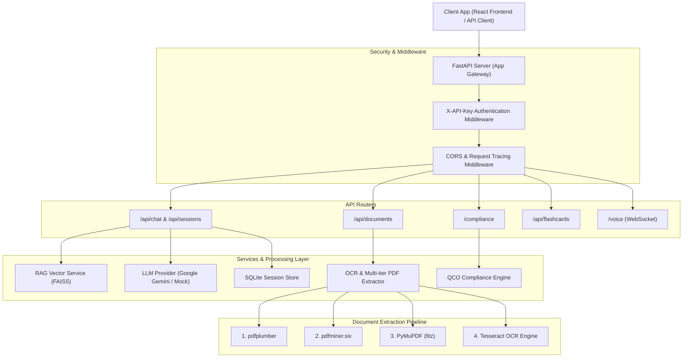

# 🇮🇳 BIS Sahayta — Compliance & Intelligence Backend API

Production-ready FastAPI backend for Bureau of Indian Standards (BIS) compliance, multi-tier document extraction (PDF/OCR), multilingual RAG Q&A, flashcard generation, session tracking, and real-time voice WebSockets.

---

## 🏗 System Architecture



---

## ⚡ Quick Start Commands

### 1. Environment Setup & Installation

```bash
# Navigate to backend directory
cd backend

# Create virtual environment (Python 3.10+)
python -m venv venv

# Activate virtual environment
# Windows (PowerShell):
.\venv\Scripts\Activate.ps1
# Linux / macOS:
source venv/bin/activate

# Install all required dependencies
pip install -r requirements.txt
```

### 2. Configuration (`.env`)

Create a `.env` file in `backend/` directory:

```env
API_KEY=demo-key-123
DEBUG=true
LLM_PROVIDER=gemini
GEMINI_API_KEY=your_gemini_api_key_here
GEMINI_MODEL=gemini-2.5-flash
OCR_PROVIDER=mock
UPLOAD_DIR=storage/uploads
VECTORSTORE_DIR=storage/vectorstore
```

### 3. Start the Backend Server

```bash
# Run FastAPI with Uvicorn (Live Reloading)
python -m uvicorn app.main:app --host 127.0.0.1 --port 8000
```

The API will be available at:
- **API Server**: `http://127.0.0.1:8000`
- **Interactive Swagger Docs**: `http://127.0.0.1:8000/docs`
- **ReDoc Documentation**: `http://127.0.0.1:8000/redoc`

---

## 🧪 Testing & Quality Assurance

### Run Unit & Integration Test Suite (117 Tests)

```bash
# Run complete pytest suite
python -m pytest -q

# Run specific regression suite
python -m pytest tests/test_regression.py -v
```

### Python Syntax & Bytecode Compilation Check

```bash
python -m compileall -q app
```

---

## 📑 Core API Endpoint Overview

### 1. Ops & Health
- `GET /health` — Liveness health check.
- `GET /ready` — Readiness check (verifies Session DB, FAISS vector store, & LLM status).

### 2. Multilingual Chat & RAG (`/api/chat`)
- `POST /api/chat` — Submit query with style (`Simple`, `Short`, `Technical`) and optional attached `document_id`.

```json
{
  "query": "What are the requirements for IS 302 toy safety?",
  "style": "Simple",
  "use_rag": true,
  "document_id": "doc-ab4beb7ee097"
}
```

### 3. Session Management (`/api/sessions`)
- `GET /api/sessions` — List all user chat sessions.
- `POST /api/sessions` — Create a new session.
- `GET /api/sessions/{id}/messages` — Retrieve chat history.
- `DELETE /api/sessions/{id}` — Delete a chat session.

### 4. Document Processing & Extraction (`/api/documents`)
- `POST /api/documents/upload` — Upload PDF/image, extract text, store metadata.
- `GET /api/documents/{id}` — Retrieve metadata & extracted text preview.
- `DELETE /api/documents/{id}` — Delete document and stored text file.
- `POST /api/documents/scan` — Inline OCR scan without disk storage.

### 5. Compliance & QCO Lookup (`/compliance`)
- `POST /compliance/check` — Verify quality control orders (QCO) by product category.

```json
{
  "category": "toys",
  "brand_name": "Demo Toys Co"
}
```

### 6. Flashcard Generation (`/api/flashcards`)
- `POST /api/flashcards/generate` — Generate study/compliance revision cards.

```json
{
  "topic": "IS 2082 Water Heaters",
  "num_cards": 3
}
```

### 7. Voice WebSockets (`/voice`)
- `WS /voice/stream` — Real-time audio chunking WebSocket endpoint (`X-API-Key` authenticated).

---

## 📂 Backend Project Directory Map

```text
backend/
├── app/
│   ├── main.py              # Application entrypoint & FastAPI app setup
│   ├── core/
│   │   ├── config.py        # Environment variables & settings
│   │   ├── exceptions.py    # Global exception handlers
│   │   └── middleware.py    # Auth & tracing middleware
│   ├── routers/
│   │   ├── chat.py          # Chat & session router
│   │   ├── documents.py     # Document upload & text extraction router
│   │   ├── compliance.py    # Compliance & QCO router
│   │   ├── flashcards.py    # Flashcards router
│   │   └── voice.py         # Voice WebSocket router
│   ├── services/
│   │   ├── llm_service.py   # Gemini & Mock LLM providers
│   │   ├── rag_service.py   # FAISS vector store & retrieval
│   │   ├── ocr_service.py   # PDF text extraction & OCR service
│   │   └── session_db.py    # SQLite session persistence database
│   └── data/                # QCO standards database JSONs
├── storage/
│   ├── uploads/             # Uploaded PDF/image files & extracted text
│   └── vectorstore/         # FAISS vector index files
├── tests/                   # Complete 117-test pytest suite
├── requirements.txt         # Python dependencies manifest
└── README.md                # Backend documentation
```
